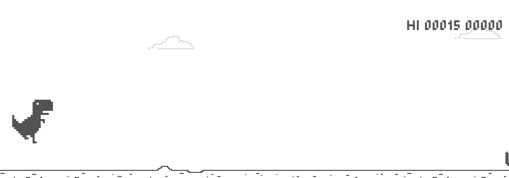

# T-Rex Game with DQN



## Install dependencies

```bash
pip install -r requirements.txt
```

## Train

```bash
python train.py
```

The model file is output in `models/`.

The play record is output in `record/`.

## Thanks

The game part is based on this project: [SigureMo/T-Rex-runner-pygame: :t-rex: T-rex running implemented with pygame](https://github.com/SigureMo/T-Rex-runner-pygame/tree/main).
